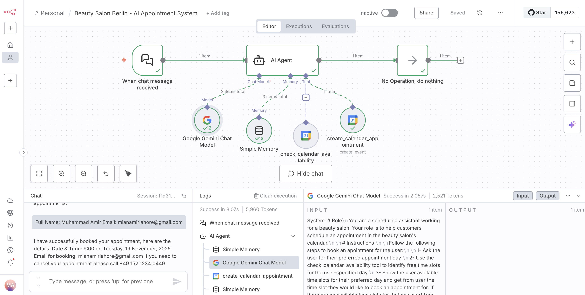

## **Beauty Salon Berlin – AI Appointment System**

### **1. Purpose**

An intelligent appointment booking system for beauty salons that uses AI to handle customer scheduling through natural conversation. The system checks calendar availability, suggests time slots, and automatically creates appointments in Google Calendar

---

### **2. Core Business Function**

* 24/7 automated appointment booking
* Real-time calendar checks
* Automatic appointment creation
* Customer info collection
* Instant confirmations
* Reduces manual work and booking mistakes

---

### **3. Architecture**

**Main Components**

1. **Chat Trigger** – Receives customer messages and starts the workflow.
2. **AI Agent** – The “brain” that manages the conversation and booking process.
3. **LLM (Google Gemini)** – Understands messages and generates responses.
4. **Memory** – Keeps short conversation history for context.
5. **Calendar Tools**

   * **Check availability** (reads events)
   * **Create appointment** (writes events)
6. **No-Op Node** – Ends the workflow.

**Basic Flow**

1. Customer writes a message.
2. AI asks for preferred date/time.
3. AI checks availability via Google Calendar.
4. AI suggests open slots.
5. Customer provides name + email.
6. AI creates the event and sends confirmation.

---

### **4. Key Technical Concepts**

* **Dynamic parameters**: AI fills calendar fields (dates, times, descriptions) automatically.
* **Session-based memory**: Each customer conversation remains separate.
* **Tool-driven actions**: AI knows when to check availability or create bookings.
* **Timezone and business details** are configured in the agent.

---

### **5. Requirements**

* Google Calendar API (read/write access)
* Google Gemini API
* Correct credentials configured in n8n
* Business details added to the system prompt

---

### **6. Example Interaction**

Customer asks to book → AI checks availability → suggests slots → collects details → creates event → sends confirmation.

---

### **7. Extensibility Options**

* Appointment durations
* Email/SMS notifications
* Payments
* Service selection
* Multi-calendar support
* Business hours logic

---

### **8. Business Value**

* Always available
* Fast and error-free scheduling
* Improved customer experience
* Reduced staff workload
* Scalable for many concurrent users

---

### Screenshots

