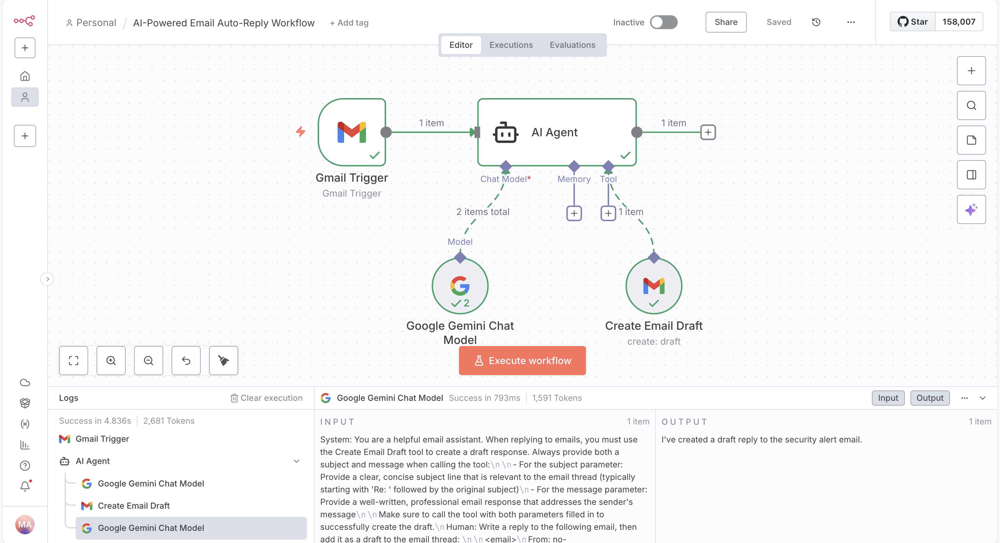

# AI-Powered Email Auto-Reply Workflow

An intelligent, fully automated Gmail assistant that monitors your inbox, understands incoming emails, generates professional replies using state-of-the-art AI, and saves them as drafts for your final review.

## Key Features (Updated November 2025)

### 🤖 Real-Time Intelligent Email Monitoring
- Continuously watches your Gmail inbox using Gmail API push notifications (Pub/Sub) – no more wasteful polling every minute
- Instant detection of new emails (sub-second latency)
- Automatically filters out newsletters, promotions, spam, and auto-replies to focus only on emails that need your attention

### 🧠 Advanced AI-Powered Response Generation
- Powered by the latest multimodal models (Google Gemini 2.5 Pro / Claude 3.7 Sonnet / Grok 3 – configurable)
- Deep contextual understanding:
  - Full email thread history
  - Sender identity and relationship (VIPs, clients, team members)
  - Tone detection and matching (formal, friendly, urgent, etc.)
  - Your personal writing style imitation (trained on your past sent emails – optional)
- Supports multiple languages with native-level fluency
- Handles complex scenarios: meeting scheduling suggestions, pricing inquiries, support tickets, negotiations, etc.

### ✉️ Professional & Thread-Aware Draft Creation
- Creates perfect reply drafts directly in your Gmail (Reply / Reply-All as appropriate)
- Preserves full conversation thread and formatting
- Automatically adds proper Re:/Fwd: prefixes and quoting
- Attaches relevant files when needed (proposals, docs, calendars)
- Adds smart labels and stars based on content (e.g., “Awaiting-Reply”, “Urgent-AI”)

### 🛡️ Safety & Human-in-the-Loop Controls
- Nothing is ever sent automatically – all responses remain as drafts for your review
- Confidence scoring: low-confidence replies are flagged for priority review
- Custom rules engine:
  - Never reply to certain senders/domains
  - Always CC specific people on certain topics
  - Block AI replies for sensitive keywords (legal, HR, financial approvals)
- One-click “Approve & Send” or “Edit before sending” from Gmail

### ⚙️ Enhanced Configuration & Customization
- Easy-to-use web dashboard for rules and preferences
- Train the AI on your writing style with a few example emails
- Define response templates for common scenarios (out-of-office, pricing, intros)
- Schedule “focus modes” – pause AI replies during meetings or off-hours

### ⚡ Truly Hands-Free Yet Fully Controllable
- Runs 24/7 on secure cloud infrastructure (no local machine required)
- End-to-end encryption for email content during processing
- GDPR/CCPA compliant – you retain full ownership of your data

## Perfect For
- Founders & executives drowning in email
- Customer support teams scaling with AI
- Sales professionals managing high-volume outreach
- Anyone who wants to reclaim hours every week while maintaining authentic, human communication

### Working AI Workflow n8n Screenshot

**You stay in control. The AI does the heavy lifting.**

