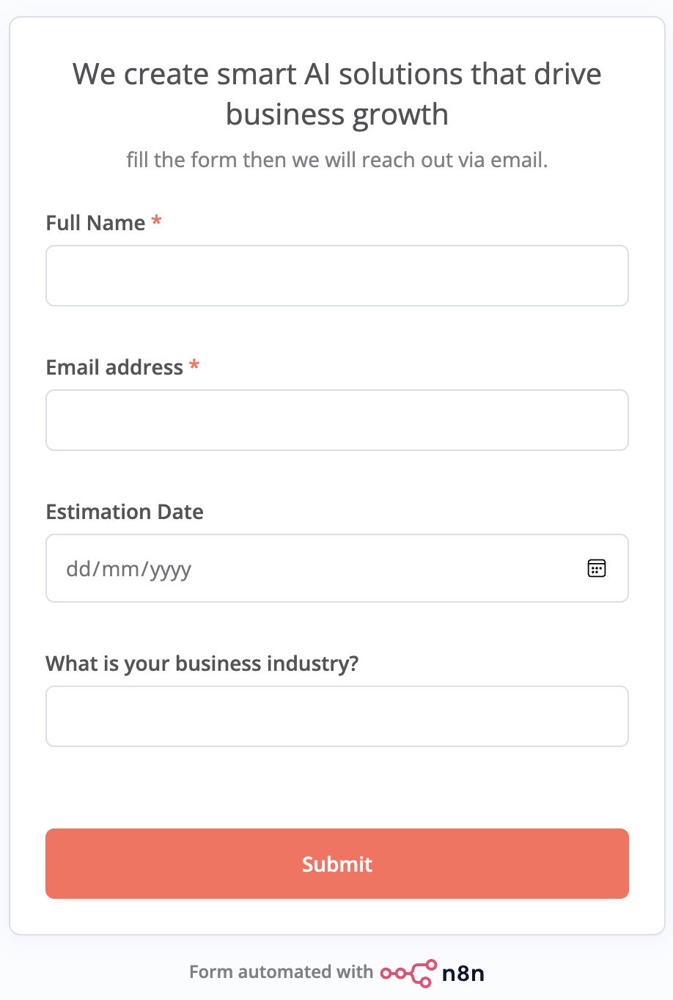
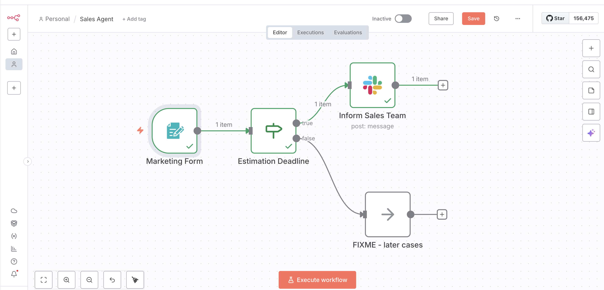
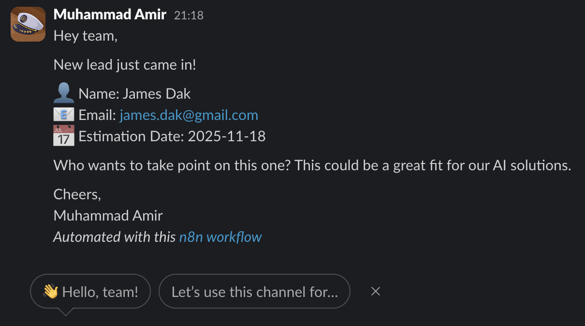

# AI Sales Lead Automation

**Agency:** Smart AI Solutions for Business Growth

## Overview
Automated sales lead qualification system that filters time-sensitive opportunities and notifies your sales team instantly.

## How It Works
1. **Customer submits form** with contact details and estimation date
2. **n8n workflow validates** if estimation date is within 7 days
3. **Slack notification sent** to sales team with qualified lead details

## Screenshots

### Lead Capture Form

*Customer-facing form for collecting lead information*

### n8n Automation Workflow

*Automated workflow for lead qualification and notification*

### Slack Notification

*Real-time alert sent to sales team*

## Notification Format
- Full Name
- Email Address
- Estimation Date
- Business Industry

## Benefits
- ⚡ Instant lead qualification
- 🎯 Focus on hot leads (7-day window)
- 📢 Real-time Slack alerts
- 🤖 100% automated workflow

## Technology Stack
- **Automation:** n8n
- **Communication:** Slack
- **Trigger:** Web form submission

---
*Built to help your sales team focus on high-priority opportunities*
